# Prechall - FCSC 2026

## Writeup EN

:flag_fr: *French writeup below*

> To keep you entertained until the launch of the FCSC 2026 on April 3, 2026, at 2:00 PM, we're offering another teaser challenge this year! It consists of three challenges to be solved in sequence, starting with the clue provided below. Solving all three challenges will earn you 1 symbolic point for the FCSC 2026, which will be displayed on the site as a 🔥 next to your username.

Just like last year, there are 3 challenges for the teaser, but this time they come one after another!

### Part 1

> You find an old SSH key, but you can't remember what it's for.
> Unfortunately, the comment associated with the public key has been lost.
>
> For this challenge, you'll find a URL that contains the second step of the prechall. 

File provided: [`i-ve-lost-my-comment.tar.xz`](src/i-ve-lost-my-comment.tar.xz)

We're provided with an OpenSSH private key and a corrupted public key. Since an OpenSSH public key is determined by its private key, regenerating it shouldn't be a problem.

And indeed, we find the `-y` option of `ssh-keygen` for this purpose:

    -y        This option will read a private OpenSSH format file
            and print an OpenSSH public key to stdout.

So we use the following command:

```bash
ssh-keygen -f i-ve-lost-my-comment -y
```

And we get the complete public key:

    ssh-ed25519 AAAAC3NzaC1lZDI1NTE5AAAAIEhnlalzNKqkJshHrAqwmaphUt4Fg652Bei6Kb7hJp/G https://fcsc.fr/PsIg0VBu7n

### Part 2

> You find a game on an old TI-83+ calculator in your attic.
> Apparently, it's endless.
>
> Can you succeed where your parents failed?
>
> For this challenge, you'll find another URL; this one contains the final step of the pre-challenge. 

File provided: [`veggie-dino.8xp`](src/veggie-dino.8xp)

This time it's a reverse challenge... but with a weird file format :grimacing: :

```
file veggie-dino.8xp 
veggie-dino.8xp: TI-83+ Graphing Calculator (assembly program)
```

It's an assembly program for the TI-83+.

I still have painful memories of my failed static analysis of [Chrominausor](https://hackropole.fr/fr/challenges/reverse/fcsc2024-reverse-chrominausor/), so we'll try dynamic analysis instead.

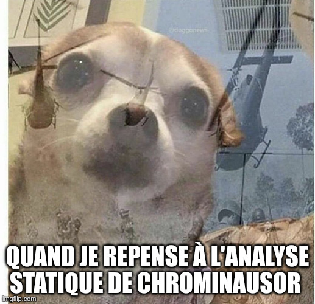

For this, we'll need a TI-83+ emulator.

After doing some research, the best option on Linux for this is [TilEm](http://lpg.ticalc.org/prj_tilem/index.html).

After several hours of struggling, I managed to install it! First, you need a bunch of special libraries (notably [TILP](https://github.com/debrouxl/tilp_and_gfm)):

```bash
sudo ./install_tilp.sh
cd tilem-2.0
./configure && make && sudo make install
```

And after fixing several installation bugs, it works!

```bash
tilem2
```

You also need to find a TI-83+ ROM (but it's pretty easy to [find](http://les83plus.free.fr/emulation.php)).

You can then transfer the `8xp` file using `Right-click` -> `Send File`.

And since it's compiled Z80 code, you need to use the `Asm` function:

    Asm(prgmDINO)

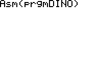

Next, enter its name:

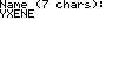

And off you go for a little dino game 

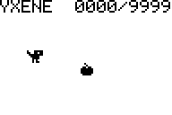

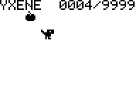

But it takes way too long to reach 9999. So we need to figure out another way to win.

I tried the TilEm debugger, it looks pretty good, but I think we can do even better!

The number 9999 is `0x270f`. So we can look in the file to see if we find that value. And bingo—we find that value (in little-endian, so `0f27`) just once. We can change it to `0100`, which is 1 in decimal. Then we transfer our modified file.

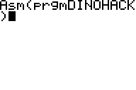

At first glance, nothing has changed; the target score at the top is still 9999.

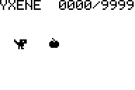

But when we collect the first apple: 

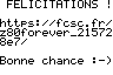

We can finally move on to Part 3!

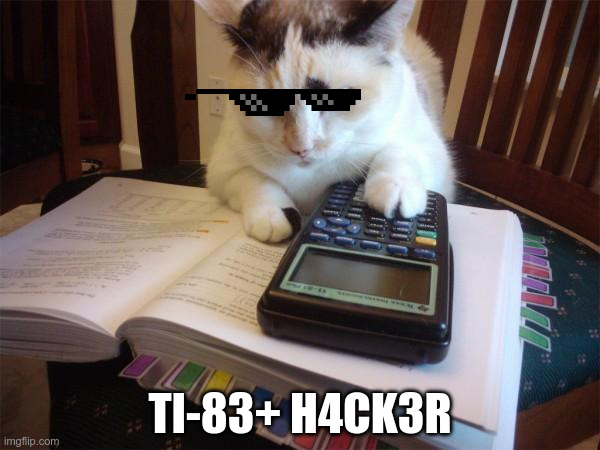

### Part 3

> Once you've found the flag hidden in this video, submit it using the form at the prechall starting point.
> 
> ⚠️ Warning: the sound may be loud. 

File provided: [`oscillart.webm`](src/oscillart.webm)

<video controls>
<source src="src/oscillart.webm" type="video/webm">
</video>

This is audio steganography... :upside_down_face:

The goal is to recover the image produced by an oscilloscope from the sound it emits.

There's a project entirely dedicated to this type of "music": [Oscilloscope Music](https://oscilloscopemusic.com/)

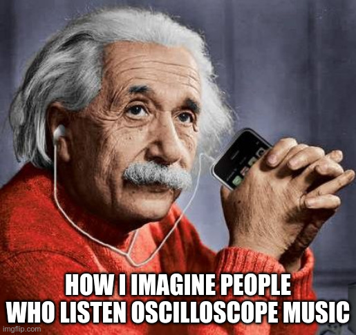

And they have open-source software that lets you convert audio to an oscilloscope waveform: [Oscilloscope!](https://oscilloscopemusic.com/software/oscilloscope/) and on [Github](https://github.com/kritzikratzi/Oscilloscope). But the Linux version is too old, so I couldn't get it to work.

Fortunately, I found another project of this type: [m1el/woscope: WebGL-powered oscilloscope](https://github.com/m1el/woscope)

And this one is much more stable. Once installed and launched with:

```bash
npm install
npm run demo
```

All we have to do is put our file (converted to `.ogg` using Audacity) in the `woscope/woscope-music` directory and go to:

```
http://localhost:9966/?file=oscillart.ogg
```

<video controls>
<source src="flag.mp4" type="video/mp4">
</video>

Then we can read the flag:

```
FCSC{vector_flag_9739}
```

And that's it, we've got our flame :fire: !

---

## Writeup FR

> Pour vous faire patienter jusqu'au 3 avril 2026 à 14h pour le lancement du FCSC 2026, nous vous proposons cette année encore une épreuve de teasing ! Celui-ci consiste en trois épreuves à résoudre successivement, dont le point de départ est donné ci-dessous. La résolution des trois épreuves vous apportera 1 point symbolique pour le FCSC 2026, et sera matérialisée sur le site par un 🔥 à côté des noms d'utilisateur. 

Comme l'année dernière, il y a 3 challenges pour le teasing mais cette fois-ci ils sont successifs !

### Partie 1

> Vous retrouvez une vieille clé SSH, mais nous ne vous rappelez plus à quoi elle correspond.
> Malheureusement, le commentaire associé dans la clé publique a été perdu.
>
> Pour cette épreuve, vous allez trouver une URL, celle-ci contient la deuxième étape du prechall. 

Fichier fourni : [`i-ve-lost-my-comment.tar.xz`](src/i-ve-lost-my-comment.tar.xz)

On nous fourni une clé privée OpenSSH et une clé publique corrompue. Comme une clé publique OpenSSH est déterminée par sa clé privée ça ne devrait pas être un problème de la regénérer.

Et effectivement on trouve l'option `-y` de `ssh-keygen` pour ça :

	-y		This option will read a private OpenSSH format file
			and print an OpenSSH public key to stdout.

Donc on utilise la commande suivante :

```bash
ssh-keygen -f i-ve-lost-my-comment -y
```

Et on trouve obtient la clé publique au complet :

	ssh-ed25519 AAAAC3NzaC1lZDI1NTE5AAAAIEhnlalzNKqkJshHrAqwmaphUt4Fg652Bei6Kb7hJp/G https://fcsc.fr/PsIg0VBu7n

### Partie 2

> Vous trouvez un jeu sur une vieille calculette TI-83+ dans votre grenier.
> Apparemment, il est infinissable.
>
> Est-ce que vous pourrez réussir là où vos parents ont échoué ?
>
> Pour cette épreuve, vous allez à nouveau trouver une URL, celle-ci contient la dernière étape du prechall. 

Fichier fourni : [`veggie-dino.8xp`](src/veggie-dino.8xp)

Cette fois c'est un chall de reverse... mais avec un format de fichier étrange :grimacing: :

```
file veggie-dino.8xp 
veggie-dino.8xp: TI-83+ Graphing Calculator (assembly program)
```

C'est un programme assembleur pour TI-83+.

J'ai encore des souvenirs douloureux de l'échec de mon analyse statique de [Chrominausor](https://hackropole.fr/fr/challenges/reverse/fcsc2024-reverse-chrominausor/), donc on va plutôt tenter de l'analyse dynamique.


Pour ça il va nous falloir un émulateur de TI-83+.

En faisant des recherches, la crème de la crème sur Linux pour ça c'est [TilEm](http://lpg.ticalc.org/prj_tilem/index.html).

Après plusieurs heures de galère, j'ai réussi à l'installer ! Il faut d'abord pleins de lib spéciales (notamment [TILP](https://github.com/debrouxl/tilp_and_gfm)):

```bash
sudo ./install_tilp.sh
cd tilem-2.0
./configure && make && sudo make install
```

Et après avoir corrigé plusieurs bug d'installation ça fonctionne !

```bash
tilem2
```

Il faut aussi trouver une ROM de TI-83+ (mais c'est assez simple à [trouver](http://les83plus.free.fr/emulation.php)).

On peut ensuite transférer le fichier `8xp` avec `Clic Droit` -> `Send File`.

Et comme c'est du code z80 compilé, il faut utiliser la fonction `Asm` :

	Asm(prgmDINO)


Il faut ensuite entrer son nom:


Et c'est parti pour un petit jeu de dino !


Mais pour atteindre 9999 y'en a pour trop longtemps. Donc on doit trouver comment gagner autrement.

J'ai essayé le debugger de TilEm, ça a l'air pas mal mais je pense qu'on peut faire encore mieux !

Le nombre 9999 c'est `0x270f`. Donc on peut regarder dans le fichier si on trouve cette valeur. Et bingo on trouve cette valeur (en little-endian donc `0f27`) une seule fois. On peut la modifier en `0100`, donc 1 en décimal. Et on transfère notre fichier modifié.


A priori rien n'a changé, le score à atteindre en haut est toujours 9999.


Mais lorsqu'on récupère la première pomme : 


On peut enfin passer à la partie 3 !


### Partie 3

> Lorsque vous aurez trouvé le flag contenu dans cette vidéo, soumettez-le dans le formulaire du point de départ du prechall.
> 
> ⚠️ Attention, le son peut être fort. 

Fichier fourni : [`oscillart.webm`](src/oscillart.webm)

<video controls>
<source src="src/oscillart.webm" type="video/webm">
</video>

C'est de la stégano audio... :upside_down_face:

L'objectif est de récupérer l'image produite par un oscilloscope à partir du son qu'il émet.

Il y a un projet entièrement dédié à ce type de "musique" : [Oscilloscope Music](https://oscilloscopemusic.com/)

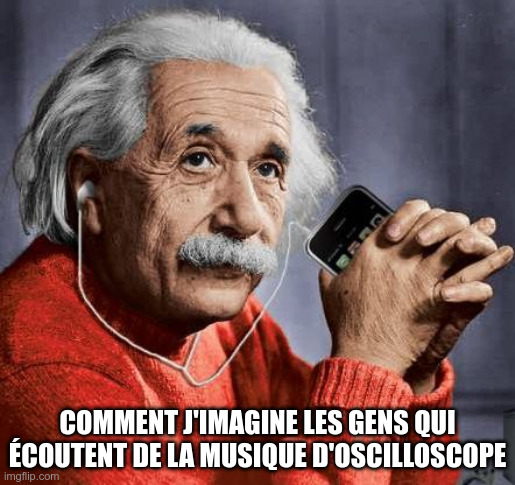

Et ils ont un logiciel Open Source qui permet justement de passer de l'audio à l'oscillo : [Oscilloscope!](https://oscilloscopemusic.com/software/oscilloscope/) et sur [Github](https://github.com/kritzikratzi/Oscilloscope). Mais la version Linux est trop vieille donc j'ai pas réussi à la faire fonctionner.

Heureusement, j'ai trouvé un autre projet de ce type : [m1el/woscope: WebGL-powered oscilloscope](https://github.com/m1el/woscope)

Et celui-ci est bien plus stable. Une fois installé et lancé avec:

```bash
npm install
npm run demo
```

On a plus qu'à mettre notre fichier (converti en `.ogg` grâce à Audacity) dans le répertoire `woscope/woscope-music` et à aller sur :

```
http://localhost:9966/?file=oscillart.ogg
```

<video controls>
<source src="flag.mp4" type="video/mp4">
</video>

Puis on peut lire le flag :

```
FCSC{vector_flag_9739}
```

Et ça y est on chope notre flamme :fire: !


## Flag

```
FCSC{vector_flag_9739}
```
